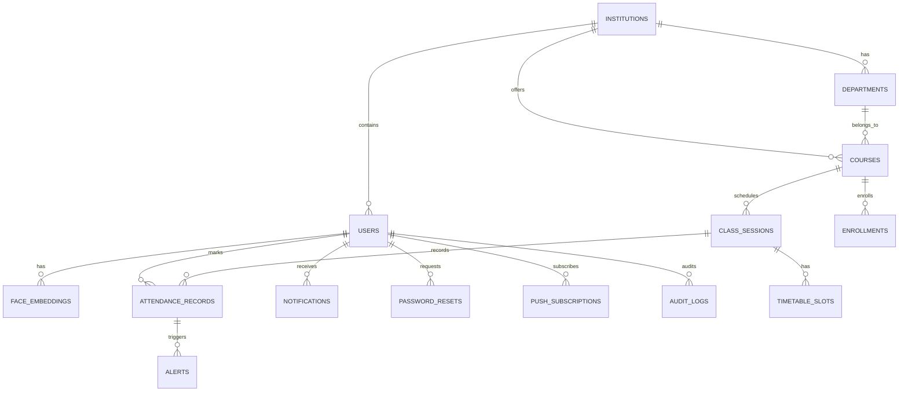

# Database Schema

## Entity-Relationship Diagram

## Tables

### users
| Column | Type | Description |
|--------|------|-------------|
| id | UUID PK | Primary key |
| email | VARCHAR(255) UNIQUE | Login email |
| full_name | VARCHAR(200) | Display name |
| hashed_password | VARCHAR(255) | bcrypt hash |
| phone | VARCHAR(20) | Optional phone |
| role | ENUM | student, faculty, hod, admin |
| institution_id | UUID FK | References institutions |
| department_id | UUID FK | Optional department |
| roll_number | VARCHAR(50) | Student roll number |
| is_active | BOOLEAN | Soft-delete flag |
| is_verified | BOOLEAN | Email verified |
| totp_enabled | BOOLEAN | 2FA enabled |
| totp_secret | VARCHAR(64) | TOTP secret |
| created_at | TIMESTAMP | Creation time |

**Indexes:** `idx_users_email`, `idx_users_institution`, `idx_users_role`

### institutions
| Column | Type | Description |
|--------|------|-------------|
| id | UUID PK | Primary key |
| name | VARCHAR(200) | Full name |
| short_name | VARCHAR(20) UNIQUE | Code/abbreviation |
| city | VARCHAR(100) | Location |
| state | VARCHAR(100) | State |
| country | VARCHAR(100) | Country |
| is_active | BOOLEAN | Active flag |
| created_at | TIMESTAMP | Creation time |

### departments
| Column | Type | Description |
|--------|------|-------------|
| id | UUID PK | Primary key |
| institution_id | UUID FK | Parent institution |
| name | VARCHAR(200) | Department name |
| code | VARCHAR(20) | Department code |
| created_at | TIMESTAMP | Creation time |

**Unique:** `(institution_id, code)`

### courses
| Column | Type | Description |
|--------|------|-------------|
| id | UUID PK | Primary key |
| institution_id | UUID FK | Parent institution |
| department_id | UUID FK | Optional department |
| faculty_id | UUID FK | Assigned faculty |
| name | VARCHAR(200) | Course name |
| code | VARCHAR(50) | Course code |
| semester | VARCHAR(20) | Semester info |
| academic_year | VARCHAR(20) | Year |
| min_attendance_pct | FLOAT | Threshold (default 75) |
| created_at | TIMESTAMP | Creation time |

### class_sessions
| Column | Type | Description |
|--------|------|-------------|
| id | UUID PK | Primary key |
| course_id | UUID FK | Parent course |
| faculty_id | UUID FK | Faculty in charge |
| date | DATE | Session date |
| start_time | TIMESTAMP | Session start |
| end_time | TIMESTAMP | Session end |
| status | ENUM | scheduled, active, ended, cancelled |
| qr_token_hash | VARCHAR(255) | QR token |
| qr_expires_at | TIMESTAMP | QR expiry |

**Indexes:** `idx_sessions_course_date(course_id, date)`

### attendance_records
| Column | Type | Description |
|--------|------|-------------|
| id | UUID PK | Primary key |
| session_id | UUID FK | Class session |
| student_id | UUID FK | Student |
| status | ENUM | present, absent, late, proxy_suspected |
| method | ENUM | qr, face, manual_override, etc. |
| face_confidence | FLOAT | ML confidence score |
| proxy_anomaly_score | FLOAT | Anomaly detection score |
| geo_accuracy_m | FLOAT | GPS accuracy |
| wifi_bssid | VARCHAR(50) | Captured BSSID |
| ble_beacon_id | VARCHAR(100) | BLE beacon |
| device_fingerprint | VARCHAR(255) | Device ID |
| verification_notes | TEXT | Notes from face check |
| is_verified | BOOLEAN | Analysis completed |
| marked_at | TIMESTAMP | When marked |

**Indexes:** 
- `idx_attendance_session_student(session_id, student_id)`
- `idx_enrollments_student_course(student_id, course_id)`

### face_embeddings
| Column | Type | Description |
|--------|------|-------------|
| id | UUID PK | Primary key |
| user_id | UUID FK UNIQUE | Student |
| embedding | VECTOR(512) | Face embedding (AES-256 encrypted) |
| model_version | VARCHAR(50) | Model used |
| is_active | BOOLEAN | Soft-delete |
| enrolled_at | TIMESTAMP | Enrollment date |

### alerts
| Column | Type | Description |
|--------|------|-------------|
| id | UUID PK | Primary key |
| student_id | UUID FK | Affected student |
| session_id | UUID FK | Related session |
| alert_type | ENUM | low_attendance, proxy_suspected, trend_anomaly |
| severity | ENUM | low, medium, high, critical |
| message | TEXT | Alert details |
| anomaly_score | FLOAT | Proxy score |
| is_resolved | BOOLEAN | Resolved flag |
| resolved_by_id | UUID FK | Who resolved |
| resolved_at | TIMESTAMP | When resolved |
| created_at | TIMESTAMP | Creation time |

### notifications
| Column | Type | Description |
|--------|------|-------------|
| id | UUID PK | Primary key |
| user_id | UUID FK | Recipient |
| title | VARCHAR(200) | Title |
| body | TEXT | Message body |
| type | VARCHAR(50) | Alert type |
| link | VARCHAR(500) | Deep link |
| is_read | BOOLEAN | Read flag |
| created_at | TIMESTAMP | Creation time |

### timetable_slots
| Column | Type | Description |
|--------|------|-------------|
| id | UUID PK | Primary key |
| course_id | UUID FK | Course |
| day_of_week | INT | 0=Mon, 6=Sun |
| start_time | TIME | Slot start |
| end_time | TIME | Slot end |
| room | VARCHAR(100) | Room number |
| building | VARCHAR(100) | Building name |
| geo_lat | FLOAT | GPS latitude |
| geo_lon | FLOAT | GPS longitude |
| geo_radius_m | FLOAT | Geo-fence radius |

**Indexes:** `idx_timetable_course_day(course_id, day_of_week)`